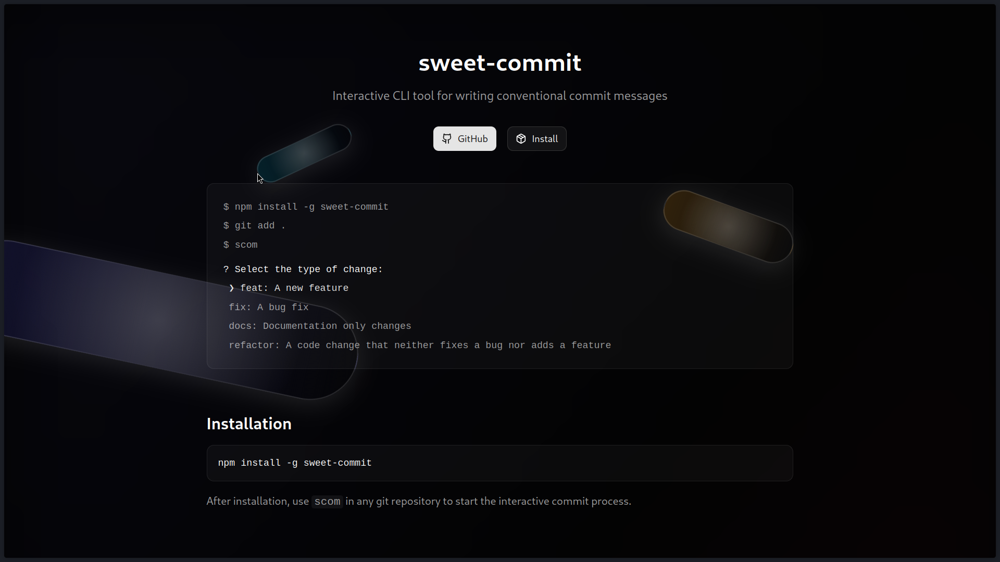

# sweet-commit



Interactive CLI tool for writing conventional commit messages.

## Overview

`sweet-commit` is an interactive command-line interface (CLI) tool designed to streamline your Git workflow by helping you generate conventional commit messages. It guides you through the process with easy-to-use prompts, ensuring your commit history is clean, consistent, and adheres to Conventional Commits specifications.

## Features

*   **Interactive Interface:** User-friendly prompts guide you through each step of creating a commit message.
*   **Conventional Commits:** Enforces conventional commit standards automatically (e.g., `feat:`, `fix:`, `docs:`, `refactor:`).
*   **Breaking Changes:** Supports adding breaking change descriptions to your commits.
*   **Issue Linking:** Easily link your commits to multiple issues.

## Installation

To install `sweet-commit` globally, use npm:

```bash
npm install -g sweet-commit
```

## Usage

After installation, navigate to any Git repository and run:

```bash
scom
```

Follow the interactive prompts to build your commit message.

## Contributing

Contributions are welcome! Please feel free to open an issue or submit a pull request.

## License

[Add License Information Here, e.g., MIT License]

## Contact

Made by [d3xfoo](https://github.com/d3xfoo)
